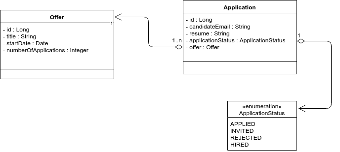
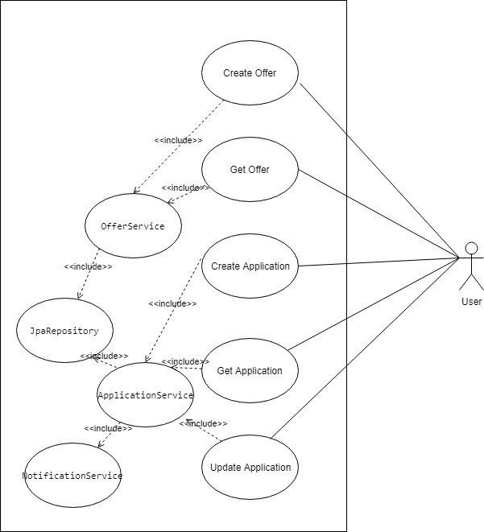
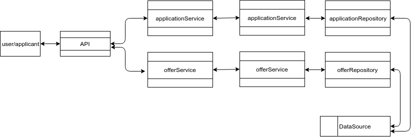
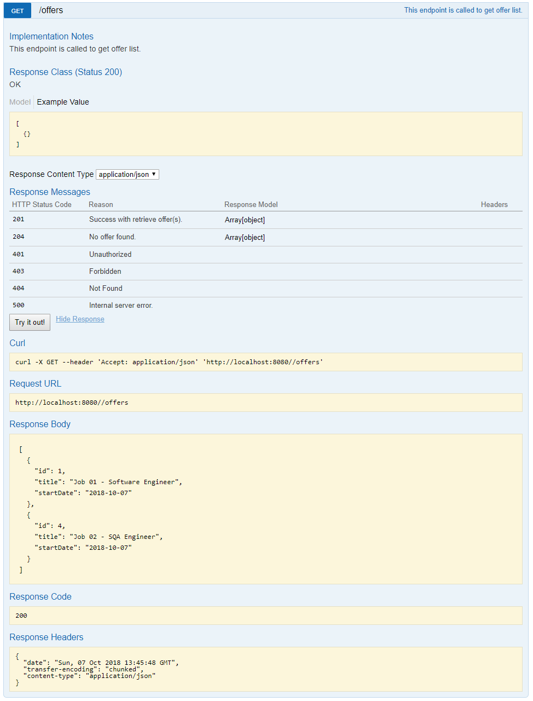
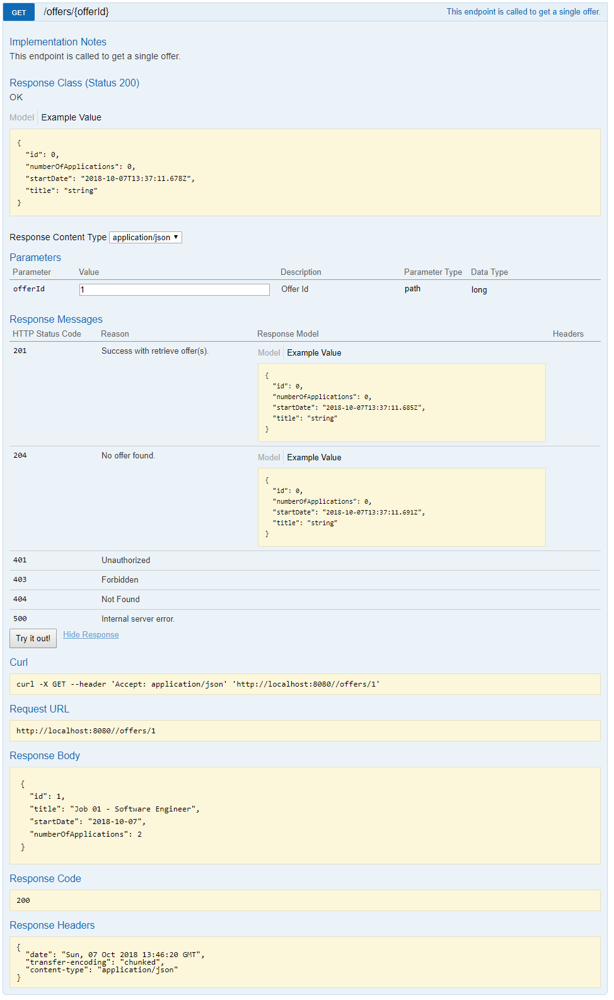
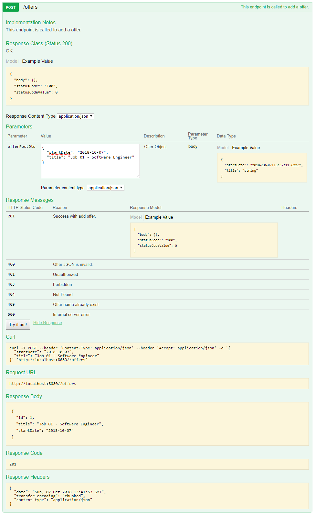
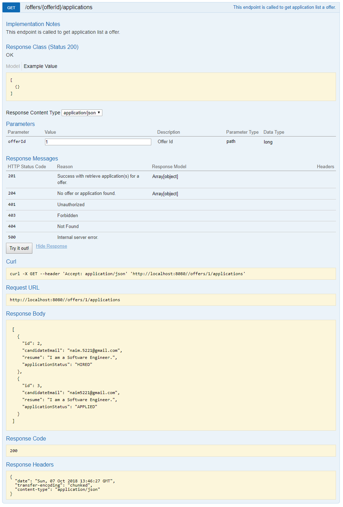
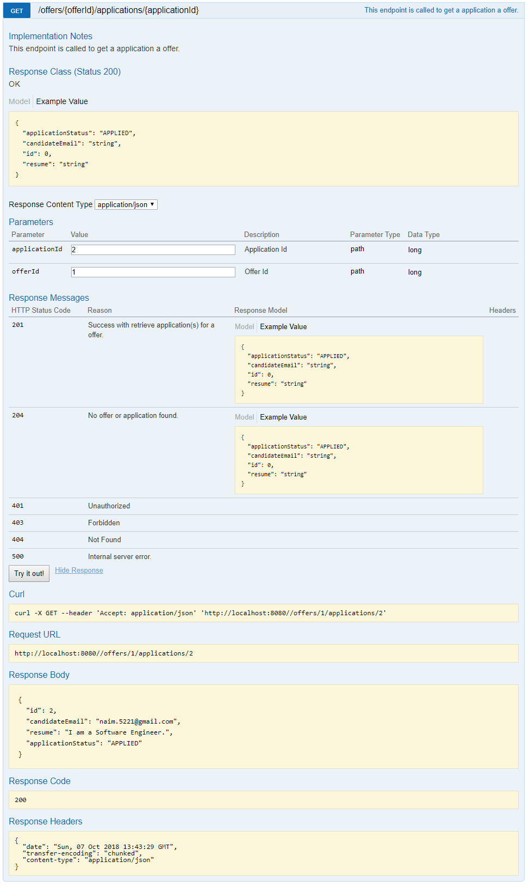
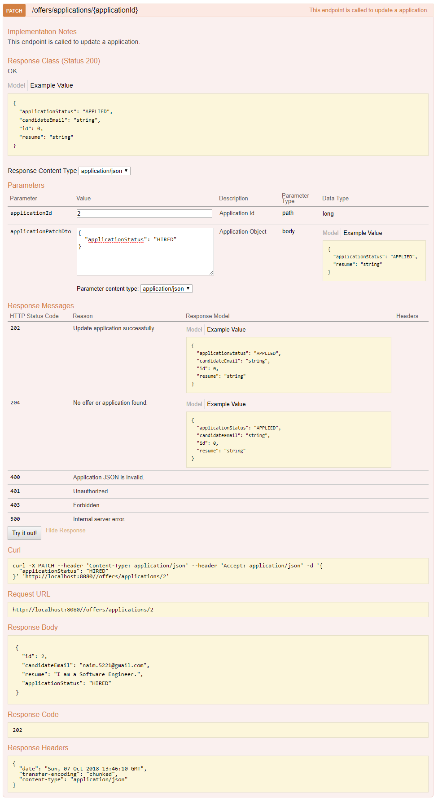

# Recruiting Process (Backend Service)

## Objective 
* Need to build a backend service with spring-boot that handles recruiting process (JSON based),
* API for job offers and applications from candidates.
* Ad-hoc calculation is necessary.
* User has to be able to create a job offer and read a single and list all offers.
* Candidate has to be able to apply for an offer.
* User has to be able to read one and list all applications per offer.
* User has to be able to progress the status of an application.
* User has to be able to track the number of applications.
* Status change should trigger a completely different business/notification case.

## Planning and Analysis

* Requirement analysis and business understanding 
* Story building and activity listing 
* TDD planning

## Design
* Component design
* API, DTO, Persistence flow
* Swagger Integration.

## Coding Design

* According to requirements, this service is pretty straightforward with some CRUD API for job offers and applications. On top of spring-boot 2.0, JpaRepository is being used to achieve the requirements. 
* To trigger completely different notification for different status, here **strategy pattern** is being used with different **singleton implementation**.


## UML

### Class Diagram


### Use-case Diagram 


### Dataflow Diagram 



## Scopes

* This application has scopes to create any type of business for different status.
* We can achieve auditing introducing some more fields to entities.

## Requirement

- [x] Need to have [JDK 8](https://docs.oracle.com/javase/8/docs/technotes/guides/install/install_overview.html) installed and available to $PATH
- [x] You need to have [Maven 3](http://maven.apache.org/install.html) installed and available to $PATH or you can simply use mvnw.


## Instruction to build
 
Project is based on Maven and can be built using the following command

*Clean Before Build:*
```
mvn clean
``` 
*Test Run:*
```
mvn test
``` 
*Package creation:*
```
mvn package
``` 

It will execute all the unit test script and validate the build. The build package will be available to **target** folder. 

## Instruction to run **
 
### IDE

Run the program with `main` method from `org.ni.recruitservice.RecruitServiceApplication` class

### Command-line
```
java -jar target/recruit-service-0.0.1-SNAPSHOT.jar
```
If you are already in **target** folder then just 
```
java -jar recruit-service-0.0.1-SNAPSHOT.jar
```
Or simply type the command below -

```
mvn spring-boot:run
```

** You have to have 8080 port free to run this application.
 
After running the application you can access it with Swagger UI using the URL below -

```
http://localhost:8080/
```

## Constraints 
* To get the count of the Applications per Offer, we are querying 2 times. Need to fetch both info at once.
* While creating swagger definition, an exception is occurring, though it is not creating any problem and it might be a library issue.
* In place of 204/400/409 for some of the request from patch API it is returning 500.

## Documentation
You can use SwaggerUI or Postman to call the exposed APIs.

Checkout API description with screenshots -

* Create an Offer 

>>User can create an Offer by simply hitting the **POST /offers** API. 

>>Example payload :

```
{
  "startDate": "2018-10-07",
  "title": "Job 02 - SQA Engineer"
}
```


* Get list of Offers

>>User can get the Offer list from the **Get /offers** API. 



* Get a single Offer

>>User can get a single Offer from the **Get /offers/{offerId}** API with offerId. 

>>Example 

>>Parameter :
```
offerId : 1
```



* Create an Application

>>User can create an Application with **POST /offers/{offerId}/applications** API

>>Example 

>>Parameter :
```
offerId : 1
```
>>Payload :
```
{
  "applicationStatus": "APPLIED",
  "candidateEmail": "naim.5221@gmail.com",
  "resume": "I am a Software Engineer."
}
```


* See list of Applications for an Offer.

>>User can get Application list under an Offer with **GET /offers/{offerId}/applications** API

>>Example 

>>Parameter :
```
offerId : 1
```


* See a particular Application under an Offer.

>>User can get a particular Application under an Offer with **GET /offers/{offerId}/applications/{applicationId}** API

>>Example 

>>Parameter :
```
offerId : 1
applicationId : 2
```


* Update a particular Application under an Offer.

>>User can get a particular Application under an Offer with **PATCH /offers/applications/{applicationId}** API

>>Example 

>>Parameter :
```
applicationId : 2
```
>>Payload :
```
{
  "applicationStatus": "HIRED"
}
```



Good luck :+1: